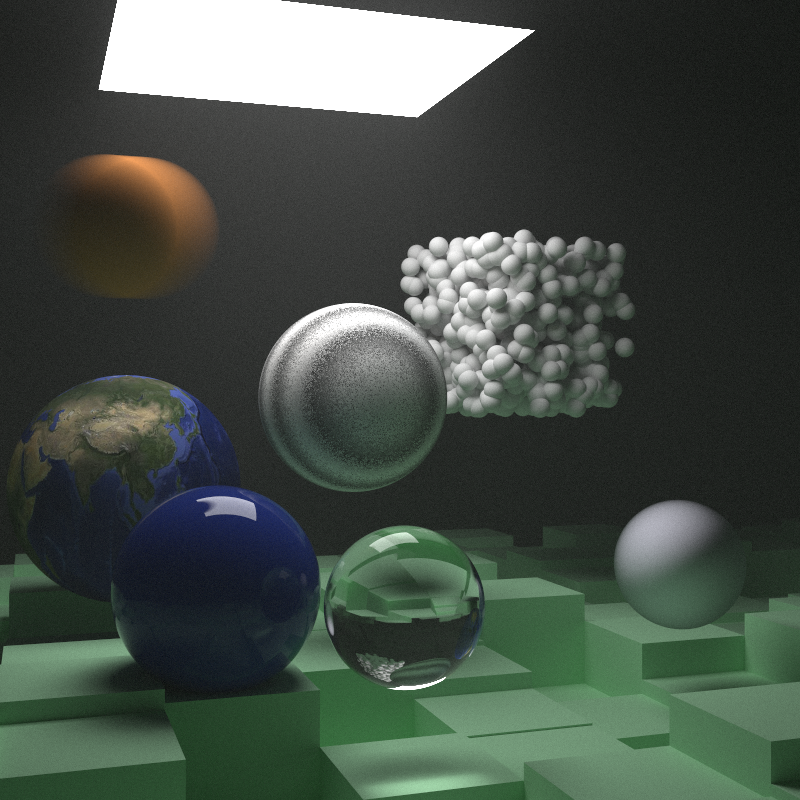

# Raytracer
Simple Raytracer developed by following Ray Tracing in One Weekend and Ray Tracing the Week After by Peter Shirley

Additional Features Developed:
- Render Timer
- PNG output
- Multithreading

Usage: ./Raytracer.exe [filename.png]

Output will be found in the ./out/Renders folder

If no acceptable filename is provided with the correct file extention, output will instead be written to output.png

To build, compile in VisualStudio with C++ development tools

